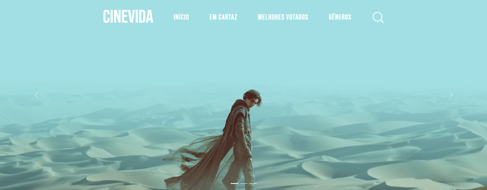
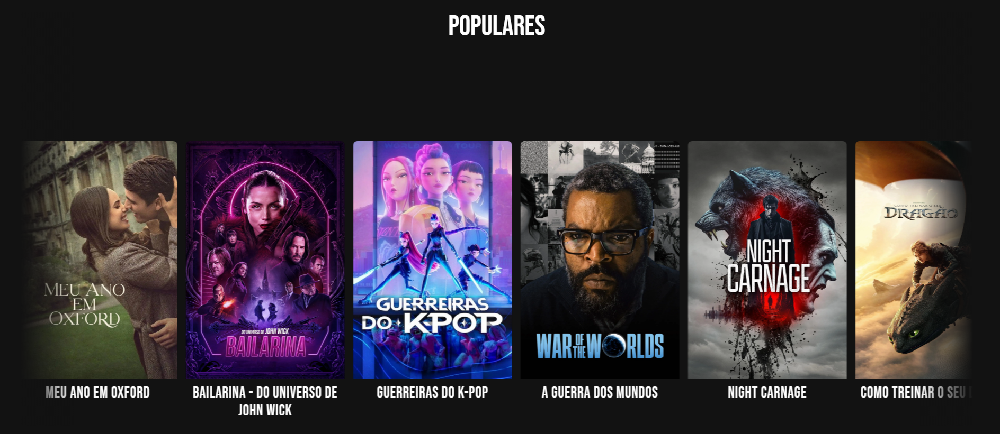
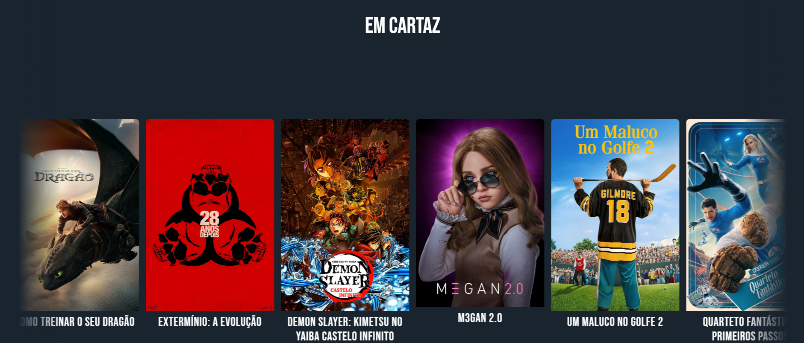
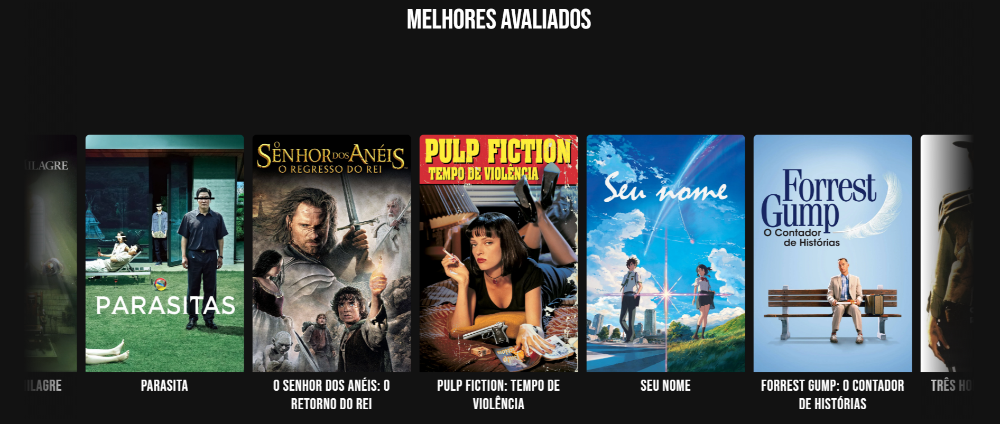
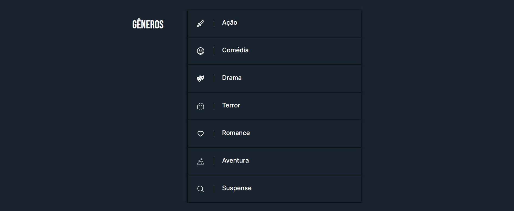
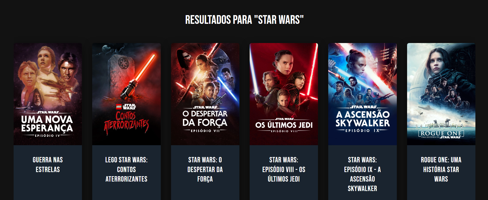

# Projeto CineVida

Uma aplicação web dinâmica e responsiva para exploração de um catálogo de filmes, consumindo dados em tempo real da API do The Movie Database (TMDB).

## Sobre o Projeto

Este projeto foi uma oportunidade para aplicar e aprofundar conhecimentos em:

- Consumo de APIs: Realizar requisições fetch a uma API REST (TMDB) para buscar e exibir dados dinamicamente.

- JavaScript Moderno: Utilizar async/await para lidar com a assincronicidade e módulos ES6 para organizar o código em uma arquitetura limpa e escalável.

- Desenvolvimento Responsivo: Criar uma experiência de usuário fluida e consistente em desktops, tablets e celulares, combinando um framework (Bootstrap) com estilização customizada.

## Etiquetas

[](./LICENSE)

<br>


<br>
[](https://cinevida.netlify.app/)
<br>
[](https://www.linkedin.com/in/thiagorib21/)
[](mailto:thiago.ribeiro2003@hotmail.com)

## ✨ Ir para o site

[🔗 Acesse o site aqui!](https://cinevida.netlify.app/)

## Screenshots







**Busca aleatória de Star Wars para demonstração**


## Funcionalidades

1. Integração com API e Conteúdo Dinâmico

- 🎬 Catálogo de Filmes: Consumo em tempo real da API do [The Movie Database (TMDB)](https://www.themoviedb.org/) para exibir filmes populares, em cartaz, melhores avaliados e por gênero.

- 🔎 Busca Assíncrona: Funcionalidade de pesquisa que redireciona para uma página de resultados, exibindo dinamicamente os filmes correspondentes ao termo buscado.

- ✨ Renderização de Componentes: Os cards de filmes são gerados dinamicamente com JavaScript, populando a interface sem a necessidade de recarregar a página.

2. Experiência do Usuário e Interatividade

- 🎟️ Carrossel de Destaques: Utilização do carrossel do Bootstrap 5 para exibir filmes em destaque na página inicial.

- 🎭 Navegação por Gêneros: Sistema de acordeão interativo que permite ao usuário expandir e visualizar filmes de um gênero específico.

- ♾️ Scroll Infinito (Desktop): Animação de scroll horizontal contínuo nos carrosséis de filmes em telas maiores, criando uma experiência de navegação fluida.

- 🌠 Animações de Scroll (Fade-in): Efeitos sutis que revelam as seções durante a rolagem da página, implementados com a API IntersectionObserver para ótima performance.

- 💻📱 UI Responsiva: Menu "hamburger" funcional, barra de pesquisa que aparece sob demanda e header que se torna sólido durante o scroll para melhor usabilidade.

## Stack utilizada

**Front-end:** HTML5, CSS3 e JavaScript.

**Frameworks / Bibliotecas:** Bootstrap 5

**APIs:** The Movie Database (TMDB) API

## Aprendizados

Desenvolver o "CineVida" foi uma jornada de aprendizado focada na criação de aplicações web dinâmicas. Durante o projeto, aprimorei significativamente minhas habilidades em JavaScript ao gerenciar múltiplas requisições assíncronas à API do TMDB, garantindo que o carregamento dos dados fosse tanto organizado quanto performático.
<br>
Esta experiência prática foi crucial para consolidar meu entendimento sobre o consumo de APIs externas e também para ampliar meu conhecimento sobre a utilização do framework Bootstrap na construção de interfaces complexas.

## ⚙️ Instalação e Execução Local

Siga os passos abaixo para visualizar o projeto.

### 1. Clone o repositório

Faça uma cópia do projeto. Abra seu terminal e coloque o comando:

```bash
git clone [https://github.com/thiagoribeiro21/Projeto-Portf-lio-Pessoal.git](https://github.com/thiagoribeiro21/Projeto-CineVida
.git)
```

### 2. Acesse a pasta do projeto

Após o download, entre na pasta que foi criada:

```bash
cd "Projeto Cine"
```

### 3. Abra o projeto no navegador

Como este é um projeto estático, basta abrir o arquivo `index.html` diretamente no seu navegador.

Você pode fazer isso de duas formas:

- **Arrastando** o arquivo `index.html` para a janela do navegador.
- **Clicando com o botão direito** no arquivo `index.html` e escolhendo "Abrir com...".

## 👨‍💻 Autor

Feito por **Thiago Ribeiro**

**Contatos:**

- **LinkedIn:** [https://www.linkedin.com/in/thiagorib21](https://www.linkedin.com/in/thiagorib21)
- **Email:** thiago.ribeiro2003@hotmail.com
- **GitHub:** [https://github.com/thiagoribeiro21](https://github.com/thiagoribeiro21)

## Licença

Este projeto está licenciado sob a Licença MIT. Veja o arquivo [LICENSE](./LICENSE) para mais detalhes.
